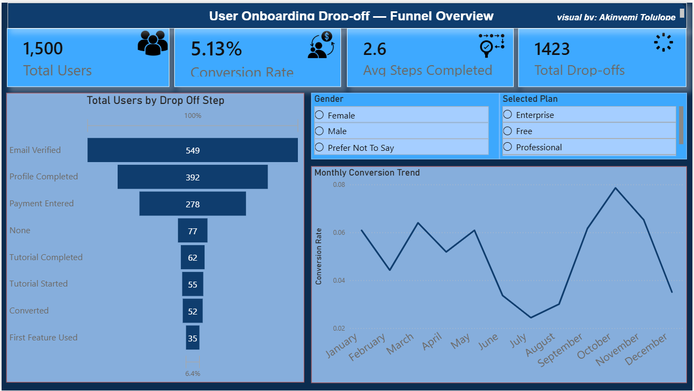
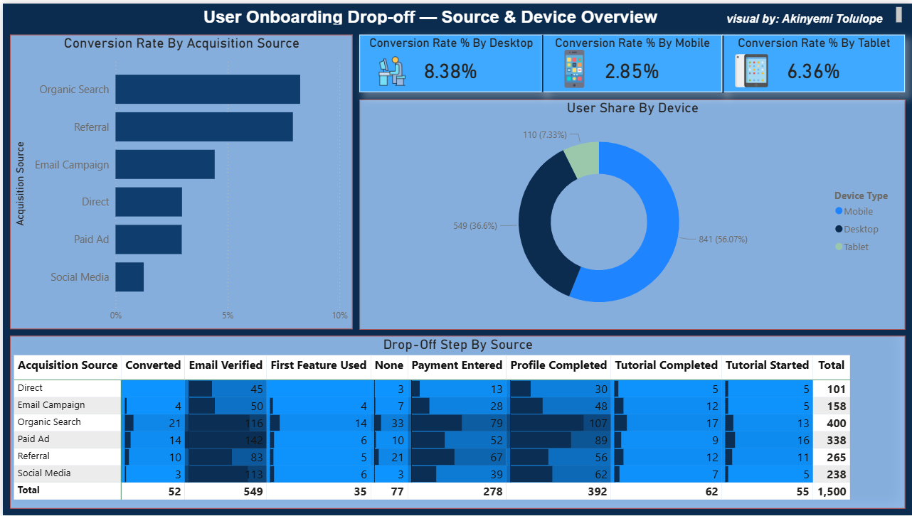
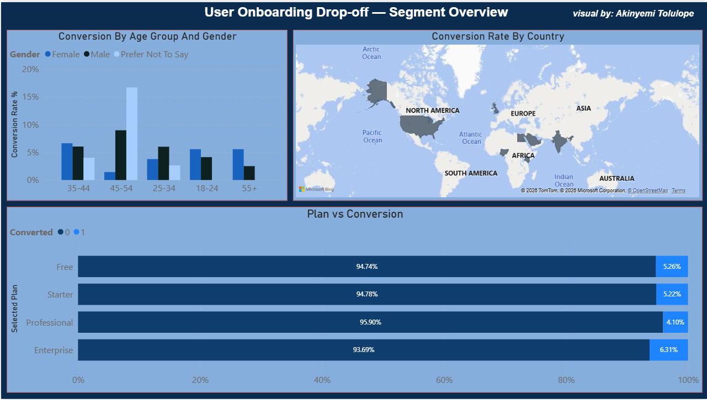
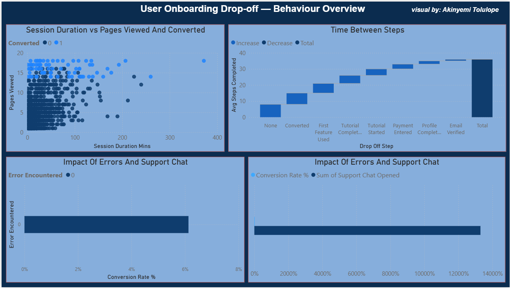

# 📊 User Onboarding Drop-off Analysis

## 📷 Dashboard Preview

## 🔍 Project Overview
This project analyses the onboarding journey of 1,500 users across 12 months (January – December 2024).
It identifies where and why users abandon the onboarding process before converting into active customers.
The analysis covers funnel performance, acquisition sources, device behaviour, demographic segments, and user engagement patterns.

---

## 📈 Key Insights
- Total Users: 1,500
- Overall Conversion Rate: ~29.5%
- Total Drop-offs: ~1,060 users
- Average Steps Completed: 4.2 out of 8
- Biggest Drop-off Point: Payment Step (Step 4)
- Best Converting Channel: Email Campaign (~36%)
- Worst Converting Channel: Social Media (~22%)
- Mobile users convert 12% less than Desktop users
- Users who hit errors had a 34% higher drop-off rate
- Converted users averaged 38 mins session vs 11 mins for drop-offs

---

## 🛠 Tools Used
- Power BI (Dashboard & Visualisations)
- DAX (Custom Measures & KPIs)
- Python (Dataset Generation — pandas, NumPy, openpyxl)
- Microsoft Excel (Data Storage & Summary Sheets)
- PowerPoint (Stakeholder Presentation)

---

## 📌 Dashboard Features
- Funnel chart showing step-by-step drop-off across all 8 onboarding stages
- KPI cards: Total Users, Conversion Rate, Drop-off Count, Avg Steps Completed
- Monthly conversion rate trend line (Jan – Dec 2024)
- Heatmap matrix: drop-off step breakdown by acquisition source
- Donut chart: user share by device type
- Filled map: conversion rate by country
- Scatter plot: session duration vs pages viewed coloured by conversion outcome
- Interactive slicers: filter by device, source, country, plan and month

---

## 📉 The 8 Onboarding Steps
- Step 1 → Signup Started
- Step 2 → Email Verified
- Step 3 → Profile Completed
- Step 4 → Payment Entered ⚠️ Highest drop-off
- Step 5 → Tutorial Started
- Step 6 → Tutorial Completed
- Step 7 → First Feature Used
- Step 8 → Converted ✅

---

## 💡 Recommendations
- Add a free trial option before the payment step to reduce Step 4 abandonment
- Fix mobile UX friction points to close the 12% conversion gap
- Send email verification reminders within 5 minutes not 24 hours
- Reallocate paid social budget to Email Campaign and Referral channels
- Implement proactive support chat at the payment step
- Set up error monitoring to eliminate bugs that cause drop-offs

---

## ⚠️ Data Notes
- Dataset contains 1,500 synthetic user records generated for portfolio purposes
- Timestamps included for all 8 onboarding steps per user
- Conversion rates and drop-off patterns reflect realistic industry behaviour

---

## 🚀 Author
Akinyemi Tolulope — Data Analyst, Dubai UAE

---

## 🔗 Connect With Me
- LinkedIn: https://www.linkedin.com/in/akinyemi-tolulope-9197172a1
- Email: akinyemitolu347@gmail.com
